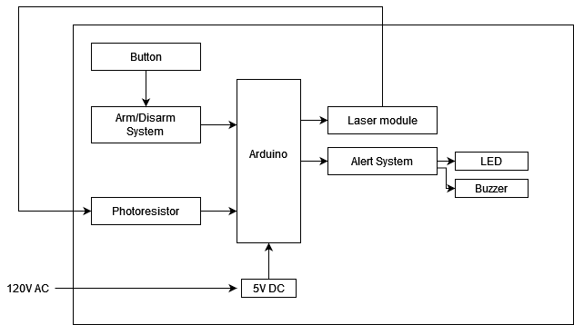

# Group 10 - Product Design Specification

## Executive Summary / Concept of Operations
Our product is an anti-theft device that will send out an alert whenever a laser beam across the defensible area is broken. This idea came from spy movies, and we thought that would be useful if we use it to prevent theft from happening. We think most house owners in the world could use it in the room where they keep their valuable things, and some banks, museums, or places that kept confidential information may also be interested in it if the device has enough laser beam to cover the room. Before we are using it, we will need to install the same number of pairs of laser pointers and photoresistors on both sides of the walls, each laser pointer must be precisely aimed at the corresponding photoresistors. There will be a controller that has a series of buttons to arm and reset the device, so it could be turned on and turned off when the buzzer or LED for an alarm on the device is on.
## Brief Market Analysis
Our intended customers are anybody that might have a need to protect a space through the use of a neat, futuristic method. The scale of the product can be altered to protect a hallway or a small enclosure for something important. Our primary competition is other, more mundane security systems such as those that use magnets to secure doors or sonic sensors to secure spaces. As the scale can change based on the needs of the customer, this could lead to a consultation service that can develop and customize the product to each individual’s needs. The components are not particularly expensive, but this service could drive some of the cost.
## Requirements
-   Must have arm/disarm interactions
-   Must detect when the laser beam is broken to the photoresistor
-   Must alert when beam is broken and the alarm is armed, this can be audio and/or visual
-   Should have a test jig in order to be portable for display
-   May implement a servo to activate the laser
## System Architecture

## Design Specification
### Sensors
- Buttons to arm and disarm, depending on time and desired complexity this can be expanded to a PIN pad or even fingerprint sensor
- Photoresistors to detect the beam and calibrate using ambient light
### Actuators
- An alarm system, can consist of audio buzzers and/or LEDs  
- Servo motor to arm the laser, this is an optional addition
### Processors
- Arduino will be used to the control system
- The Arduino IDE will be able to handle the logic that we’ll need
### Power
- All devices will be low power, so a wall wart to the arduino should suffice   